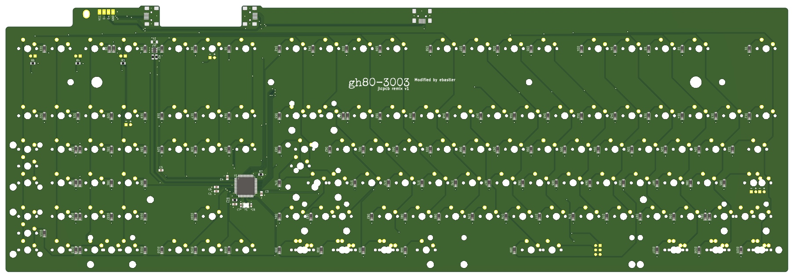

# GH80-3003 jlc

PCB designed by evyd13, edited to be assembled at jlcpcb by ebastler

Gerber, BOM and CPL file for jlcpcb assembly are included. They have been tested and confirmed working, but I can not guarantee that jlcpcb will not make any breaking changes. jlcpcb stocks might change, parts could go EOL. Compare MCU/diode/SRV05 rotation before ordering, to be sure.

If you order a small batch and sell the unneeded ones, please keep the license in mind.

## jlcpcb components (already in BOM/assembly files)

| Reference  | jlcpcb part # | Description    | Value    | Package  | Amount |
| ---------- | ------------- | -------------- | -------- | -------- | ------:|
| C1-C4      | C49678        | Capacitor      | 0.1 uF   | 0805     | 4      |
| C5         | C1779         | Capacitor      | 4.7 uF   | 0805     | 1      |
| C6         | C28323        | Capacitor      | 1 uF     | 0805     | 1      |
| C7, C8     | C1653         | Capacitor      | 22 pF    | 0603     | 2      |
| D1-D114    | C81598        | Diode          | 1N4148   | SOD-123  | 114    |
| F1         | C183290       | Fuse           | 750 mA   | 1206     | 1      |
| R1, R2     | C17561        | Resistor       | 22       | 0805     | 2      |
| R3, R4, R6 | C17513        | Resistor       | 1 k      | 0805     | 3      |
| R5, R6     | C17414        | Resistor       | 10 k     | 0805     | 2      |
| U1         | C44854        | MCU            | 32U4     | QFP-44   | 1      |
| U2         | C85364        | ESD Protection | SRV-05   | SOT-23-6 | 1      |
| Y1         | C13738        | Crystal        | 16 MHz   | 3225-4   | 1      |

## Other parts
| Reference  | LCSC part #   | Description   | Value    | Package  | Amount  |
| ---------- | ------------- | ------------- | -------- | -------- | -------:|
| K1-K114    |               | Keyswitch     |          | MX-like  | depends |
| L1-L3      |               | LED           |          | 3 mm THT | 3       |
| J2-J4      | C105424       | Connector     | mini USB | SMD      | 3       |
| SW1        | C92584        | Pushbutton    |          | SMD      | 1       |